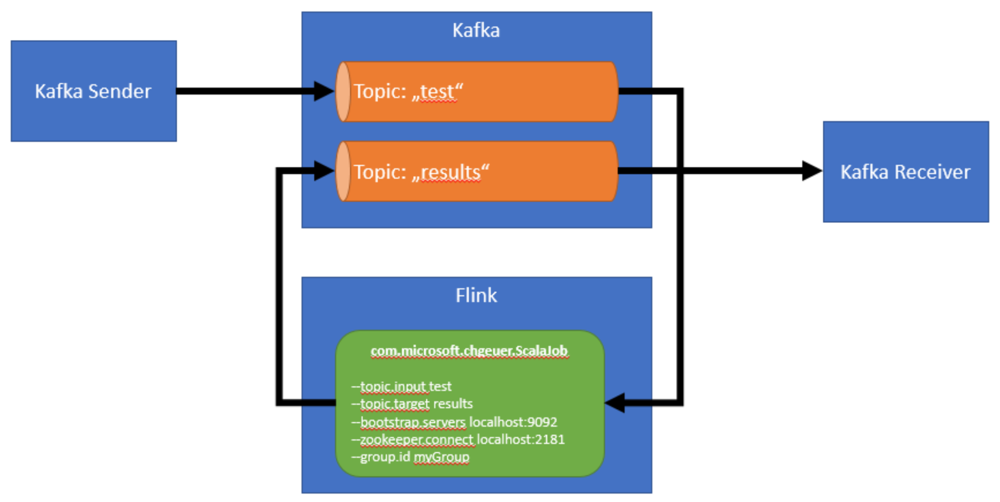

# Installed

- Windows 10 :-)
- jdk1.8.0_121
- scala-2.11.8
- apache-maven-3.3.9
- sbt-launcher-packaging-0.13.13
- kafka_2.11-0.10.1.1
- flink-1.2.0-bin-hadoop27-scala_2.11

# Sample on using Apache Flink and Kafka together

## Compile the Scala example

```shell
cd scala
sbt assembly package
``` 

## Compile the Java example

```shell
cd java
mvn package
``` 

## Submit Jobs

Go to the [Flink Portal](http://localhost:8081/#/overview)

- Scala Class: `com.microsoft.chgeuer.ScalaJob`
- Java Class: `com.microsoft.chgeuer.JavaJob`

```
--topic.input test --topic.target results --bootstrap.servers localhost:9092 --zookeeper.connect localhost:2181 --group.id myGroup
```

